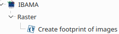
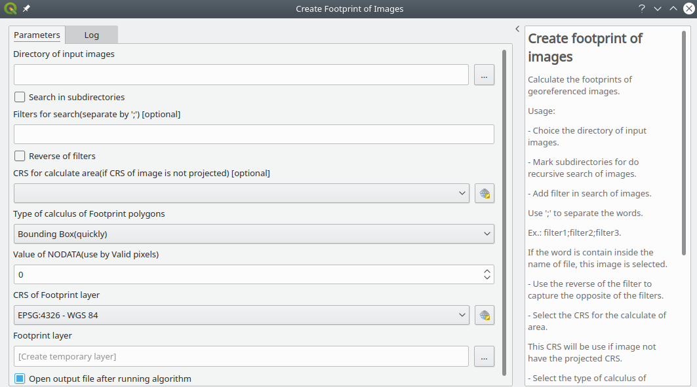
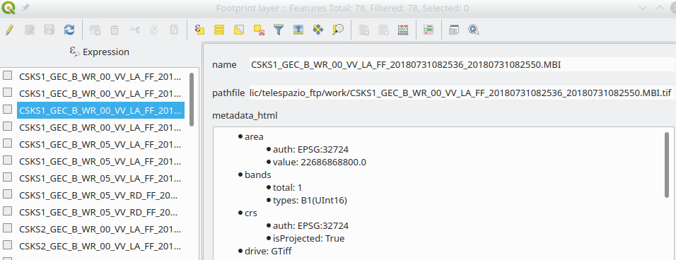
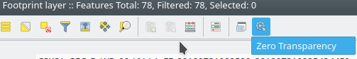
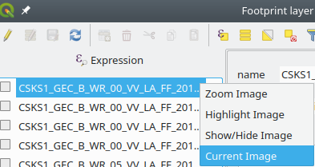
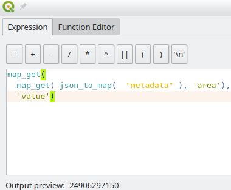

# IBAMA Processing Plugin  

***IBAMA Processing*** is a plugin that add algorithms in Processing Toolbox.

## Algorithms: ##  

1. **Create footprint of images:**  

 * Goal:  
 Generate a catalog layer of images from a directory.  
    * Catalog layer: It is a layer of the type polygons, containing, address, name and metadata of the images.
    * The images to be searched must have CRS (Coordinate Reference System).
 * Setup of images search:
    * Images sources directory.
    * If is to do the search in subdirectories.
    * Search filter:
        * Filter: This is a word that will be used in the search, where, if it exists in the file name, the file is selected.
        * The Search Filter can use more than one word, in which case the ';' character is used as a separator.
        * Reverse of filter: Files are selected using the opposite(negative) of search filter.
    * CRS for calculate area:
        *  The selected CRS is used in the case of images that have geographic CRS.
        * The polygon geometry of the image is converted to the selected CRS, if the image is with geographical CRS, otherwise, it uses the CRS of the image to calculate the area.
    * Calculation type of the footprint polygon:
        * Bounding Box: It obtains the image rectangle, being a fast method, because it uses the georeferencing data of the image.
        * Valid pixels: Corresponds to a polygon that limits the pixels that have the reflectance values.
          * Methodology:
            * Converts the original image to a binary image where the value 1 corresponds to the pixel values ​​different of NODATA value (see below).
            * Vectorize the binary image.
            * Generates a polygon with the coordinates of the outer side of the polygon vectorized.  
            Note: The area is calculated with this polygon.
            * Smoothes this polygon (decreases the number of vertices).
    * Value of NODATA: Value used for areas that do not have reflectance.  
    Note: Usually have the ZERO value
* Result:  
  * The Footprint layer with the fields: Name, pathfile, metadata(String/Json), metadata_html(String/HTML) and ,metadata_size.
  * The Footprint layer have a specific form, that, can see the metadata how a tree.
  
  * Actions:
    * Layer:
      * Zero Transparence: Add transparence for Pixels with zero value for all image added.  
      
    * Feature:
      * Zoom Image: Zoom in on the image extension.
      * Hightlight Image: Highlight in the image area.
      * Show/Hide Image: Show(add image if not exists) or hide(invisible).
      * Current Image: Set current image in layer panel.
      
      

* Considerations:
  * Can use expressions for get specific value in metadata field.  
  Ex: map_get( map_get( json_to_map(  "metadata" ), 'area'),  'value')
  
